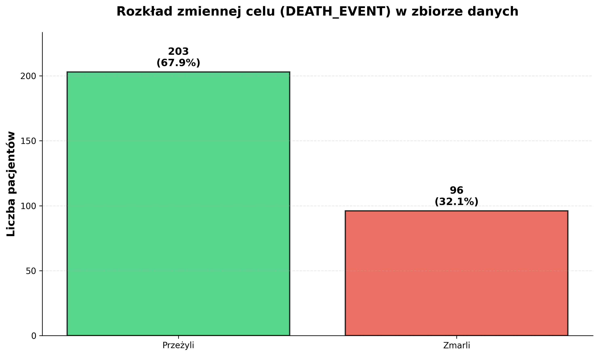
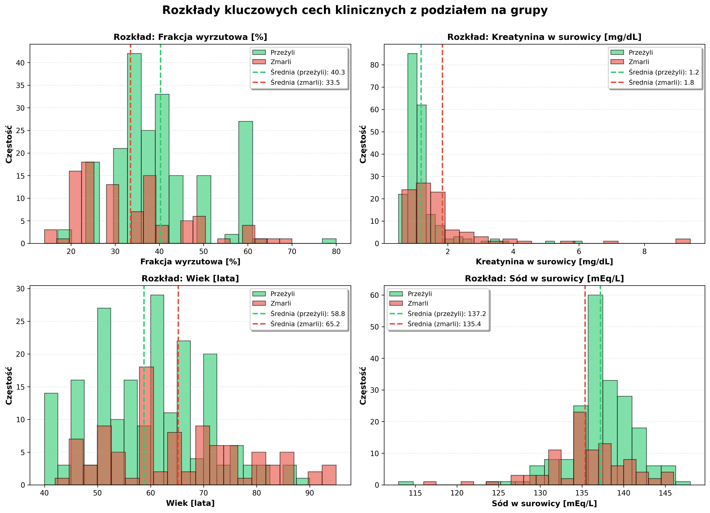
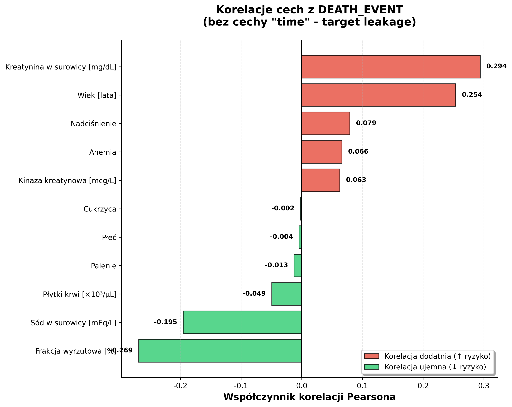
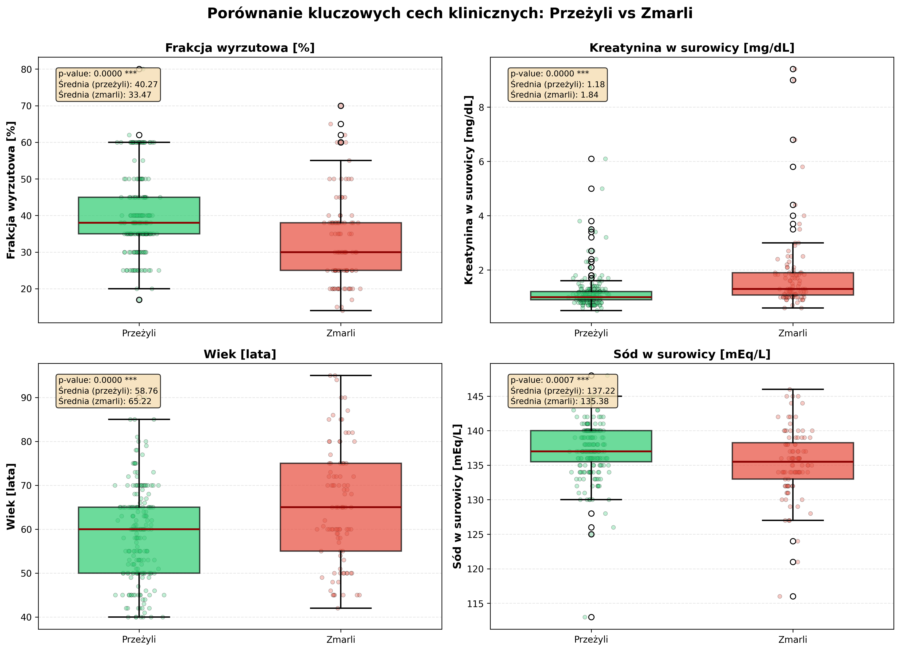
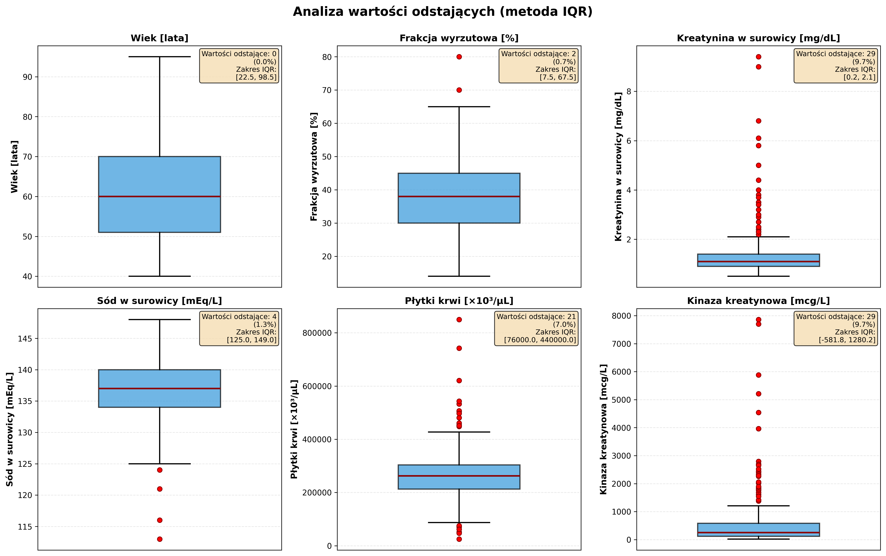
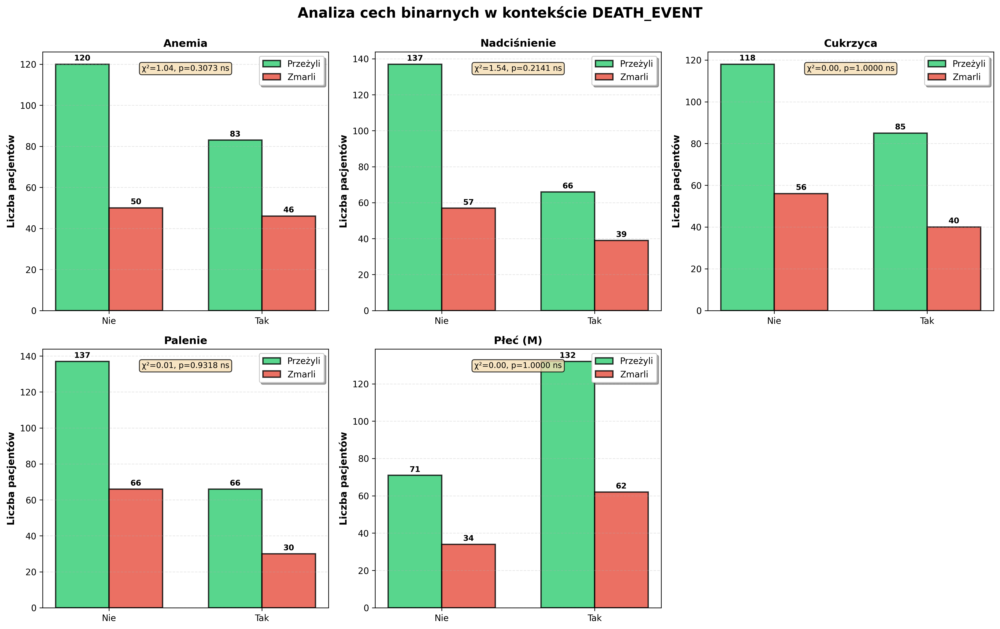

# 📊 Przewodnik po Eksploracyjnej Analizie Danych (EDA) dla Początkujących

**Autor:** Heart Failure Research Team  
**Data:** 29 grudnia 2024  
**Cel:** Wyjaśnienie krok po kroku, jak przeprowadzić eksploracyjną analizę danych na przykładzie zbioru o niewydolności serca.

---

## Wprowadzenie: Czym jest Eksploracyjna Analiza Danych (EDA)?

Wyobraź sobie, że jesteś detektywem, a zbiór danych to miejsce zbrodni. Zanim zaczniesz formułować teorie i wskazywać winnych, musisz dokładnie zbadać wszystkie ślady, poszlaki i dowody. Musisz zrozumieć, co się stało, kim są zaangażowane osoby i jakie relacje je łączą.

**Eksploracyjna Analiza Danych (EDA)** to właśnie taka praca detektywistyczna na danych. To proces, w którym "rozmawiamy" z danymi, aby zrozumieć ich główne cechy, znaleźć wzorce, wykryć anomalie i wyciągnąć pierwsze wnioski. EDA nie polega na budowaniu skomplikowanych modeli, ale na **zrozumieniu danych**, z którymi pracujemy.

### Dlaczego EDA jest tak ważna?

- **Unikasz błędów:** Pozwala wykryć problemy w danych (np. braki, błędy, wartości odstające), zanim wpłyną one na wyniki Twoich modeli.
- **Lepiej rozumiesz problem:** Dowiadujesz się, które cechy są najważniejsze i jak są ze sobą powiązane.
- **Masz lepsze pomysły:** Analiza danych inspiruje do tworzenia nowych cech (tzw. *feature engineering*) i wyboru odpowiednich algorytmów.
- **Budujesz fundamenty:** To jak solidne fundamenty pod budowę domu. Bez nich cała konstrukcja (model) może się zawalić.

---

## Krok 1: Pierwsze spotkanie z danymi

Na tym etapie poznajemy nasz zbiór danych. Sprawdzamy jego "dowód osobisty": ile ma wierszy, ile kolumn i jak się nazywają.

### 1.1. Wczytanie i podstawowe informacje

- **Liczba wierszy (próbek):** 299 (każdy wiersz to jeden pacjent)
- **Liczba kolumn (cech):** 13 (każda kolumna to jedna informacja o pacjencie, np. wiek, płeć)

### 1.2. Zrozumienie cech (kolumn)

Nasz zbiór danych ma 13 kolumn. Jedna z nich jest naszą **zmienną celu** (to, co chcemy przewidzieć), a pozostałe to **cechy** (informacje, które użyjemy do przewidywania).

- **Zmienna celu:** `DEATH_EVENT` - mówi nam, czy pacjent zmarł (1) czy przeżył (0).
- **Cechy:**
  - **Cechy numeryczne (liczbowe):** `age`, `ejection_fraction`, `serum_creatinine`, `serum_sodium`, `platelets`, `creatinine_phosphokinase`, `time`.
  - **Cechy binarne (dwie opcje, 0/1):** `sex`, `smoking`, `diabetes`, `high_blood_pressure`, `anaemia`.

### 1.3. Sprawdzenie brakujących wartości

Czy w naszych danych są jakieś "dziury"? Czy brakuje nam jakichś informacji? W naszym przypadku odpowiedź brzmi: **NIE**. Wszystkie dane są kompletne, co jest świetną wiadomością!

---

## Krok 2: Analiza zmiennej celu (DEATH_EVENT)

Zanim zaczniemy analizować cechy, musimy zrozumieć, co tak naprawdę chcemy przewidzieć. Jak często pacjenci umierali?

### Pojęcie: Niezbalansowanie klas

Wyobraź sobie, że chcesz przewidzieć, czy jutro będzie padać. Jeśli wiesz, że w Twoim mieście pada tylko 10 dni w roku, możesz zawsze mówić "nie będzie padać" i mieć rację w 97% przypadków! Ale czy taki model jest użyteczny? Nie.

Podobnie jest w naszych danych. Jeśli jedna z grup (np. zmarli) jest znacznie mniejsza od drugiej (przeżyli), mówimy o **niezbalansowaniu klas**. To ważne, bo model może nauczyć się ignorować mniejszą grupę.

### Wyniki

> **Rysunek 1.** Rozkład zmiennej celu (DEATH_EVENT). Widzimy, że 203 pacjentów (68%) przeżyło, a 96 (32%) zmarło.

**Wniosek:** Mamy do czynienia z niezbalansowaniem klas w stosunku 2:1. Musimy o tym pamiętać na etapie modelowania!

---

## Krok 3: Analiza cech numerycznych (liczbowych)

Teraz przyjrzymy się cechom, które są liczbami. Jakie mają wartości? Jakie są ich rozkłady?

### Pojęcie: Rozkład danych

Rozkład mówi nam, jak często występują różne wartości. Wyobraź sobie, że mierzysz wzrost wszystkich uczniów w szkole. Najwięcej będzie osób o średnim wzroście, a najmniej bardzo niskich i bardzo wysokich. To jest właśnie rozkład.

### Wyniki

> **Rysunek 2.** Rozkłady czterech najważniejszych cech numerycznych. Kolor zielony to pacjenci, którzy przeżyli, a czerwony - ci, którzy zmarli.

**Interpretacja:**

- **Frakcja wyrzutowa:** U pacjentów, którzy zmarli (czerwony), wykres jest przesunięty w lewo. Oznacza to, że mieli oni **niższą** frakcję wyrzutową (słabsze serce).
- **Kreatynina w surowicy:** U zmarłych (czerwony), wykres jest przesunięty w prawo. Mieli oni **wyższy** poziom kreatyniny (gorsza funkcja nerek).
- **Wiek:** U zmarłych (czerwony), wykres jest przesunięty w prawo. Byli oni **starsi**.
- **Sód w surowicy:** U zmarłych (czerwony), wykres jest lekko przesunięty w lewo. Mieli oni **niższy** poziom sodu.

Już na tym etapie widzimy wyraźne różnice między grupami!

---

## Krok 4: Analiza korelacji

Czy cechy są ze sobą powiązane? Czy jeśli jedna cecha rośnie, to druga też rośnie? A może maleje? O tym mówi nam korelacja.

### Pojęcie: Korelacja

Korelacja to miara, która mówi nam, jak silnie dwie zmienne są ze sobą powiązane. Przyjmuje wartości od -1 do 1:

- **+1:** Idealna korelacja dodatnia (gdy jedna zmienna rośnie, druga też rośnie).
- **-1:** Idealna korelacja ujemna (gdy jedna zmienna rośnie, druga maleje).
- **0:** Brak korelacji (zmienne nie są ze sobą liniowo powiązane).

### Wyniki

> **Rysunek 3.** Korelacje między cechami a zmienną celu (DEATH_EVENT).

**Interpretacja:**

- **Czerwone słupki (korelacja dodatnia):** Im wyższa wartość cechy, tym **większe** ryzyko zgonu. Najważniejsze to **kreatynina** i **wiek**.
- **Zielone słupki (korelacja ujemna):** Im wyższa wartość cechy, tym **mniejsze** ryzyko zgonu. Najważniejsze to **frakcja wyrzutowa** i **sód**.

### 🚨 Uwaga na TARGET LEAKAGE!

Na oryginalnym wykresie korelacji (nie pokazanym tutaj) najwyższą korelację miała cecha `time`. Co to jest `time`? To czas, po którym pacjent zmarł lub zakończono obserwację. Czy znamy tę wartość na początku? Nie! Użycie tej cechy do przewidywania byłoby oszustwem - to tak, jakby znać wynik meczu przed jego rozpoczęciem. To zjawisko nazywa się **target leakage** (przeciek informacji o celu) i jest jednym z najpoważniejszych błędów w uczeniu maszynowym. Dlatego cecha `time` **musi zostać usunięta** z modeli predykcyjnych.

---

## Krok 5: Porównanie grup (Przeżyli vs Zmarli)

Teraz bezpośrednio porównamy obie grupy, aby sprawdzić, czy różnice, które zauważyliśmy, są **istotne statystycznie**.

### Pojęcie: Test t-Studenta i p-value

- **Test t-Studenta:** To narzędzie statystyczne, które pozwala porównać średnie wartości w dwóch grupach (np. średni wiek zmarłych vs średni wiek żyjących).
- **p-value (wartość p):** To wynik tego testu. Mówi nam, jakie jest prawdopodobieństwo, że zaobserwowane różnice są dziełem przypadku. Przyjmuje się, że jeśli **p-value < 0.05**, to różnica jest **istotna statystycznie** (mało prawdopodobne, że jest przypadkowa).

### Wyniki

> **Rysunek 4.** Porównanie czterech kluczowych cech między grupami. Adnotacje w lewym górnym rogu każdego panelu pokazują p-value.

**Interpretacja:**

We wszystkich czterech przypadkach **p-value jest bardzo małe (p < 0.001)**, co oznaczamy jako `***`. Oznacza to, że różnice między grupami są **bardzo istotne statystycznie**. To potwierdza, że te cztery cechy są świetnymi kandydatami do naszego modelu predykcyjnego!

- **Zmarli mieli:** niższą frakcję wyrzutową, wyższą kreatyninę, wyższy wiek i niższy sód.

---

## Krok 6: Analiza wartości odstających (Outliers)

Czy w naszych danych są jakieś "dziwne" wartości, które mocno odbiegają od reszty? To są właśnie wartości odstające.

### Pojęcie: Wartości odstające (Outliers)

To obserwacje, które są bardzo nietypowe w porównaniu z innymi. Na przykład, jeśli w grupie studentów wszyscy mają 20-25 lat, a jedna osoba ma 70 lat, to jest to wartość odstająca. Outliery mogą być wynikiem błędu pomiaru, ale mogą też reprezentować rzadkie, ale prawdziwe przypadki.

### Wyniki

> **Rysunek 5.** Wykresy pudełkowe pokazujące wartości odstające (czerwone kropki) dla wybranych cech.

**Interpretacja:**

- Najwięcej wartości odstających obserwujemy w **kreatyninie** (9.7%) i **kinazie kreatynowej** (9.7%).
- **Czy powinniśmy je usuwać?** W medycynie - absolutnie nie! Wysoka kreatynina to nie błąd, to oznaka ciężkiej choroby nerek. Te wartości, choć odstające, niosą bardzo ważną informację o stanie pacjenta. Musimy je uwzględnić w modelowaniu.

---

## Krok 7: Analiza cech binarnych

Na koniec przyjrzymy się cechom, które mają tylko dwie opcje (Tak/Nie, 0/1), takim jak anemia, cukrzyca czy palenie.

### Pojęcie: Test chi-kwadrat

To test statystyczny używany do sprawdzenia, czy istnieje związek między dwiema cechami kategorycznymi (np. czy anemia jest powiązana ze zgonem).

### Wyniki

> **Rysunek 6.** Analiza cech binarnych w kontekście DEATH_EVENT. Adnotacje pokazują wyniki testu chi-kwadrat.

**Interpretacja:**

- **Anemia** i **nadciśnienie** mają istotny statystycznie związek z DEATH_EVENT (p < 0.05). Oznacza to, że występowanie tych chorób zwiększa ryzyko zgonu.
- **Cukrzyca, palenie i płeć** nie wykazują istotnego związku w tej prostej analizie.

---

## Podsumowanie i wnioski z EDA

Po naszej detektywistycznej pracy zebraliśmy kluczowe dowody:

1.  ✅ **Dane są dobrej jakości:** Brak braków, co ułatwia pracę.
2.  ⚠️ **Problem niezbalansowania:** Mamy więcej pacjentów, którzy przeżyli, niż zmarli. Musimy o tym pamiętać.
3.  🎯 **Główni podejrzani (najważniejsze cechy):**
    - **Frakcja wyrzutowa** (im niższa, tym gorzej)
    - **Kreatynina w surowicy** (im wyższa, tym gorzej)
    - **Wiek** (im wyższy, tym gorzej)
    - **Sód w surowicy** (im niższy, tym gorzej)
4.  🚨 **Krytyczny błąd do uniknięcia:** **Target leakage** z cechą `time`. Musimy ją usunąć z modeli predykcyjnych.
5.  📈 **Wartości odstające są ważne:** Nie usuwamy ich, bo niosą cenną informację kliniczną.

### Co dalej?

Teraz, gdy rozumiemy nasze dane, możemy przejść do kolejnych etapów:

- **Inżynieria cech (Feature Engineering):** Tworzenie nowych, jeszcze lepszych cech na podstawie tych, które mamy.
- **Preprocessing:** Przygotowanie danych do modelowania (np. normalizacja).
- **Modelowanie:** Budowa modeli uczenia maszynowego (np. sieci neuronowych), które nauczą się przewidywać `DEATH_EVENT` na podstawie naszych "podejrzanych" cech.

Eksploracyjna Analiza Danych dała nam solidne fundamenty i mapę drogową do dalszej pracy. Jesteśmy gotowi, aby zacząć budować inteligentny model!
