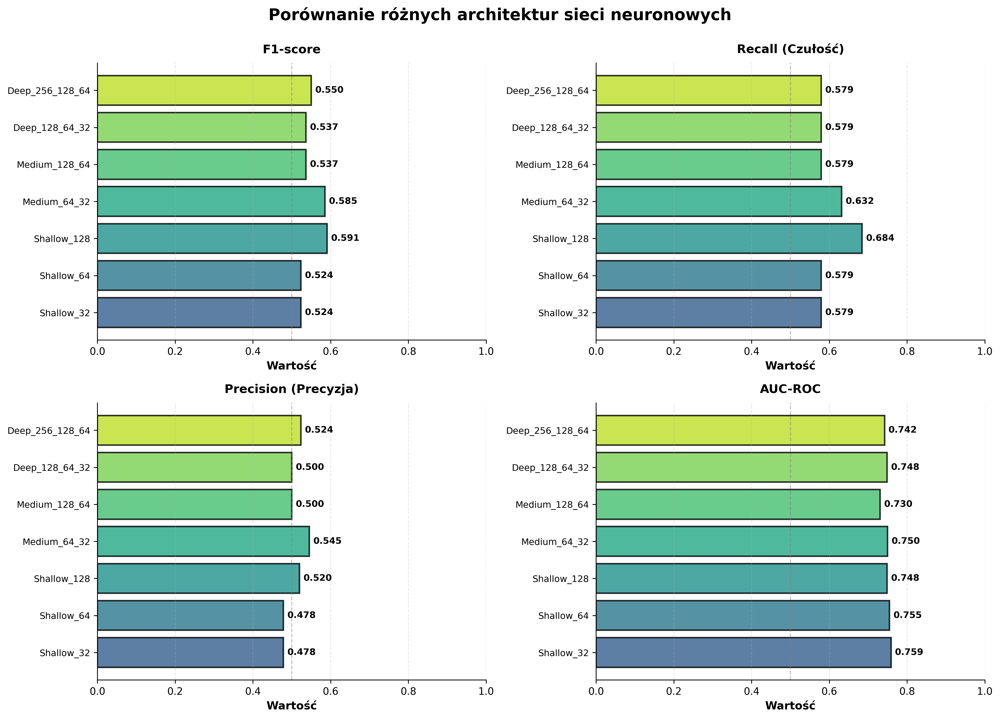
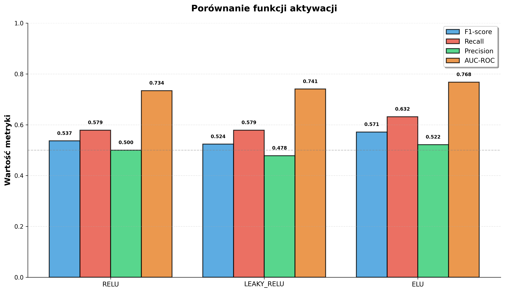
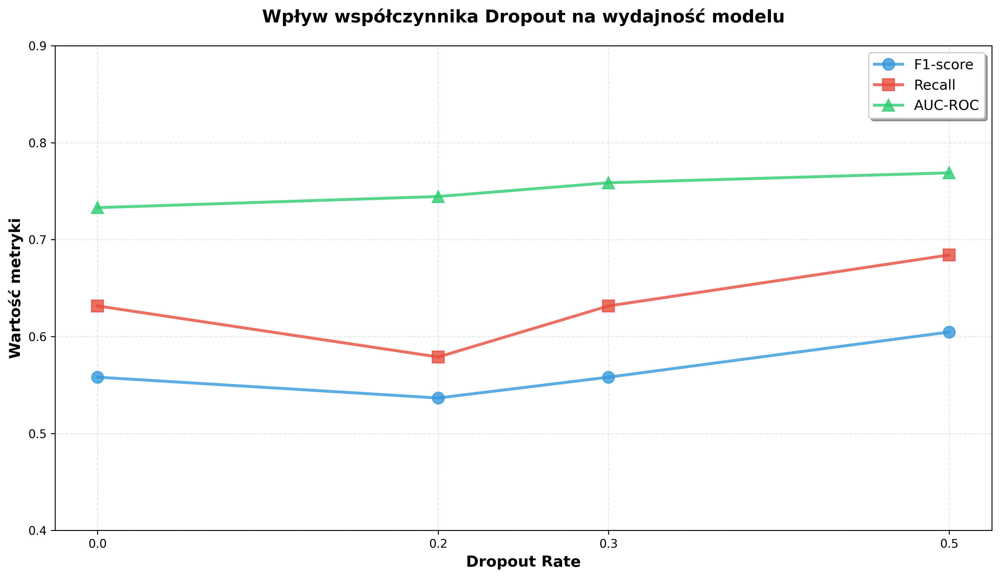
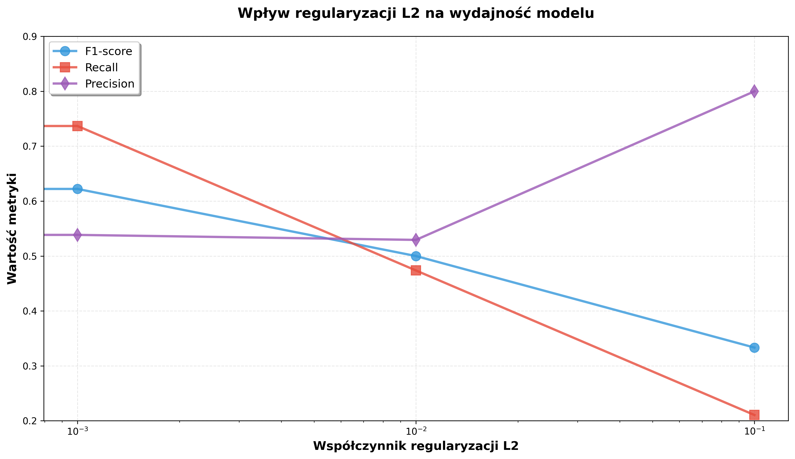
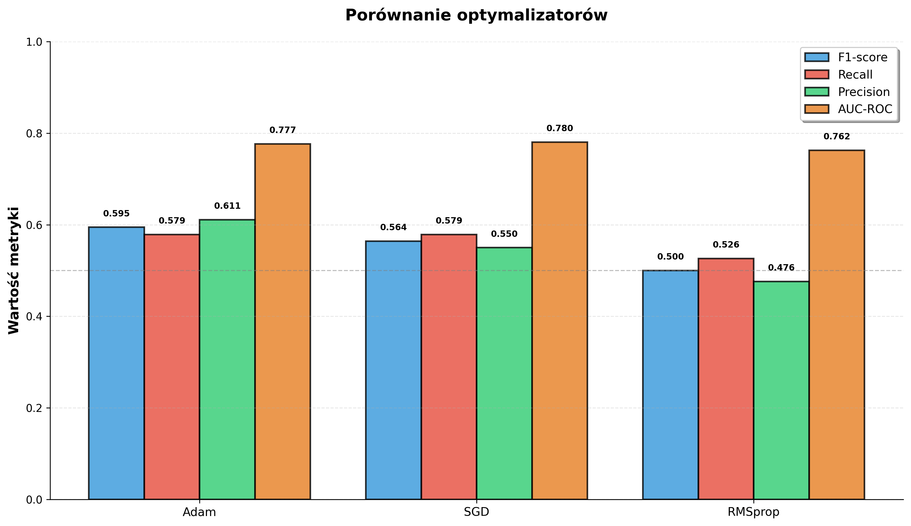
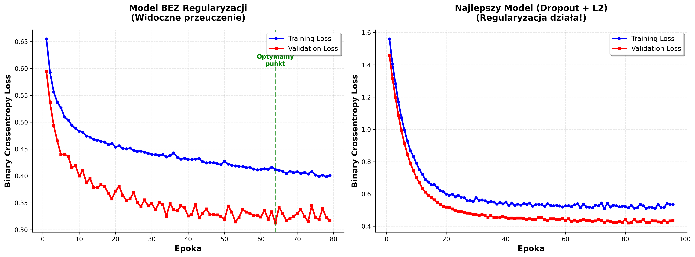
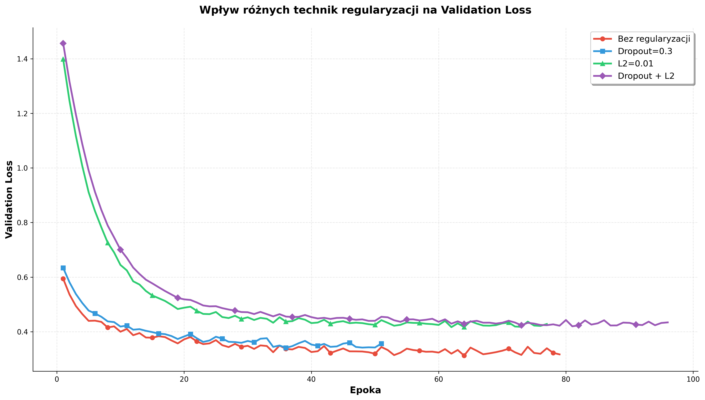
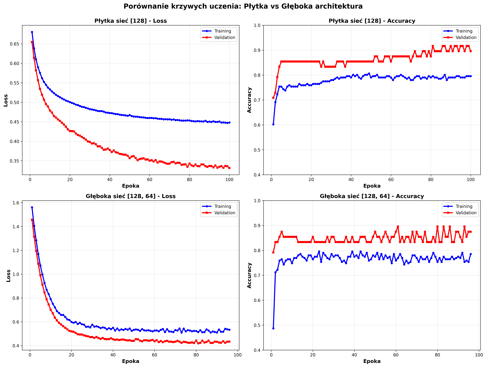
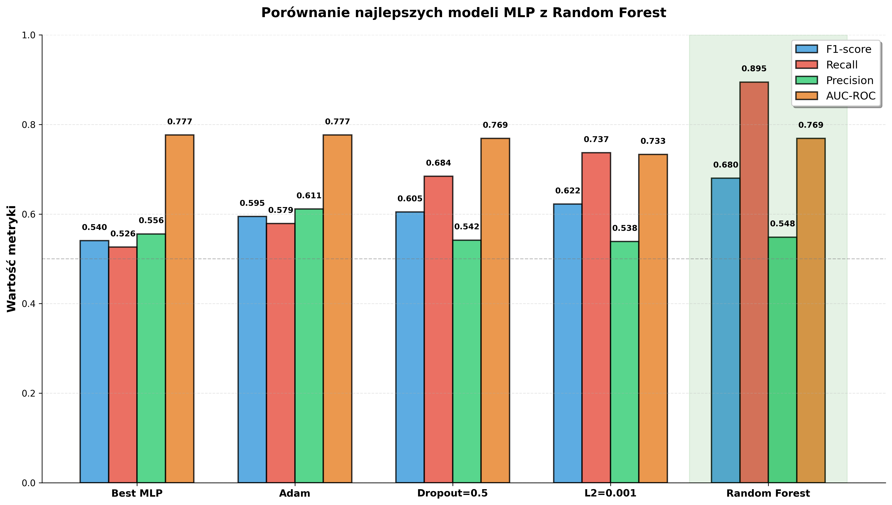
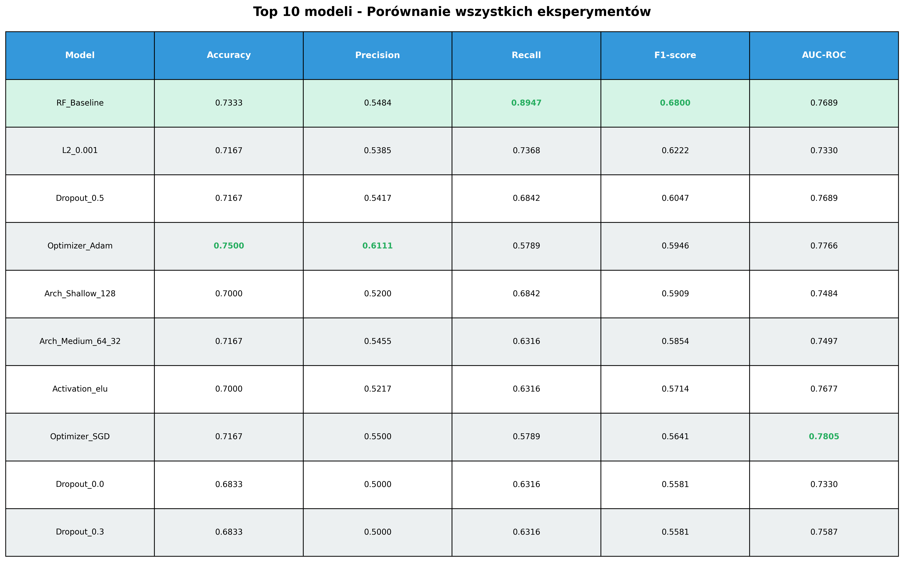

# 🧠 Przewodnik po Eksperymentach z Sieciami Neuronowymi (MLP)

**Autor:** Heart Failure Research Team  
**Data:** 29 grudnia 2024  
**Cel:** Wyjaśnienie, jak systematycznie budować i optymalizować sieć neuronową (MLP) oraz porównanie jej wyników z modelem Random Forest.

---

## Wprowadzenie: Czym jest Sieć Neuronowa (MLP)?

Wyobraź sobie sieć neuronową jako **mózg do wynajęcia**. Składa się ona z połączonych ze sobą "neuronów" ułożonych w warstwy. Każdy neuron to prosty kalkulator, który odbiera sygnały od innych, przetwarza je i wysyła dalej. Ucząc sieć, pokazujemy jej tysiące przykładów, a ona sama dostosowuje siłę połączeń między neuronami, aby nauczyć się rozpoznawać skomplikowane wzorce.

**Wielowarstwowy Perceptron (MLP)** to najpopularniejszy typ takiej sieci. Jest jak uniwersalny scyzoryk - potrafi nauczyć się niemal każdej zależności w danych, jeśli jest odpowiednio duży i dobrze wytrenowany. W medycynie może odkryć ukryte, nieliniowe związki między danymi pacjenta a ryzykiem choroby, których prostsze modele by nie zauważyły.

### Dlaczego to robimy?

- **Aby znaleźć złożone wzorce:** Sieci neuronowe potrafią modelować bardzo skomplikowane, nieliniowe zależności, które są poza zasięgiem wielu klasycznych modeli.
- **Aby sprawdzić alternatywę:** Chcemy zobaczyć, czy inne, bardziej elastyczne podejście da lepsze wyniki niż sprawdzony Random Forest.
- **Aby zbadać wpływ hiperparametrów:** Chcemy zrozumieć, jak architektura, funkcje aktywacji czy regularyzacja wpływają na działanie sieci.

---

## Punkt Odniesienia: Model Random Forest

Naszym mistrzem do pokonania jest model Random Forest z poprzednich etapów. To do jego wyników będziemy porównywać nasze sieci neuronowe.

**Wyniki modelu Random Forest (Baseline):**

| Metryka | Wartość |
|---|---|
| **F1-score** | **0.6800** |
| **Recall (Czułość)** | **0.8947** |
| **Precision (Precyzja)** | 0.5484 |
| **AUC-ROC** | 0.7689 |

Czy "mózg do wynajęcia" (MLP) pokona "mądrość tłumu" (Random Forest)? Zobaczmy!

---

## Seria Eksperymentów: Krok po Kroku do Najlepszego Modelu

Zbudowanie dobrej sieci neuronowej to proces. Przeprowadziliśmy serię kontrolowanych eksperymentów, aby znaleźć optymalną konfigurację.

### Eksperyment 1: Jaki rozmiar mózgu? (Architektura)

Sprawdziliśmy, jak liczba warstw i neuronów wpływa na wyniki. Testowaliśmy sieci od "płytkich" (1 warstwa) do "głębokich" (3 warstwy).

> **Rysunek 1.** Porównanie metryk dla różnych architektur. Najlepsze wyniki (zwłaszcza F1-score i Recall) osiągnęła architektura `Shallow_128` (jedna warstwa ze 128 neuronami).

**Wnioski:**
- **Głębiej nie znaczy lepiej:** Najgłębsze sieci (`Deep_...`) miały jedne z gorszych wyników. Prawdopodobnie były zbyt skomplikowane dla tak małego zbioru danych i zaczynały się przeuczać.
- **Optymalny rozmiar:** Najlepszy kompromis między złożonością a skutecznością osiągnęła stosunkowo prosta, ale szeroka sieć z jedną warstwą 128 neuronów.

### Eksperyment 2: Jak neurony "myślą"? (Funkcje Aktywacji)

Funkcja aktywacji decyduje, czy i jak silnie neuron ma "zareagować". Porównaliśmy trzy najpopularniejsze: `ReLU`, `LeakyReLU` i `ELU`.

> **Rysunek 2.** Porównanie metryk dla różnych funkcji aktywacji. `ELU` i `ReLU` dały bardzo zbliżone, dobre wyniki, podczas gdy `LeakyReLU` wypadła nieco słabiej.

**Wnioski:**
- **ELU i ReLU na czele:** Obie te funkcje okazały się bardzo skuteczne. `ELU` dała minimalnie lepszy F1-score i AUC, co może sugerować, że jej zdolność do obsługi ujemnych wartości była w tym przypadku korzystna.
- **Wybór nie jest krytyczny:** Różnice nie były drastyczne, co pokazuje, że dla tego problemu wybór między `ReLU` a `ELU` nie jest kluczową decyzją.

### Eksperyment 3 i 4: Jak powstrzymać "kujona"? (Regularyzacja)

Sieci neuronowe, jak pilny uczeń, mogą nauczyć się danych treningowych na pamięć (przeuczenie, overfitting), ale potem słabo radzą sobie z nowymi danymi. Regularyzacja to techniki, które zmuszają sieć do uogólniania wiedzy. Sprawdziliśmy dwie metody: **Dropout** (losowe wyłączanie neuronów) i **L2** (karanie za zbyt duże wagi).

> **Rysunek 3.** Wpływ współczynnika Dropout. Najlepszy F1-score (0.6047) i AUC (0.7689) uzyskano przy `Dropout=0.5`, co sugeruje, że silna regularyzacja była potrzebna.

> **Rysunek 4.** Wpływ regularyzacji L2. Najlepszy F1-score (0.6222) uzyskano przy `L2=0.001`. Zbyt duża wartość (`L2=0.1`) drastycznie obniżyła Recall, ponieważ model stał się zbyt "ostrożny".

**Wnioski:**
- **Regularyzacja jest kluczowa:** Zarówno Dropout, jak i L2 znacząco poprawiły wyniki w porównaniu do modelu bez regularyzacji (F1-score z 0.53 do ponad 0.60).
- **Optymalny poziom:** Istnieje "złoty środek". Zbyt mała regularyzacja nie zapobiega przeuczeniu, a zbyt duża może "zdusić" model i uniemożliwić mu naukę.

### Eksperyment 5: Jaki styl nauki? (Optymalizatory)

Optymalizator to algorytm, który decyduje, jak sieć ma się uczyć i modyfikować swoje wagi. Porównaliśmy trzy popularne: `Adam`, `SGD` i `RMSprop`.

> **Rysunek 5.** Porównanie optymalizatorów. `Adam` i `SGD` dały najlepsze i bardzo zbliżone wyniki, znacznie przewyższając `RMSprop`.

**Wnioski:**
- **Adam i SGD wygrywają:** `Adam`, często będący domyślnym wyborem, okazał się bardzo skuteczny. Co ciekawe, klasyczny `SGD` z momentum dotrzymywał mu kroku, co pokazuje, że nie zawsze najnowsze algorytmy są najlepsze.
- **Wybór ma znaczenie:** `RMSprop` w tym przypadku wyraźnie sobie nie poradził, co dowodzi, że wybór optymalizatora jest ważną decyzją projektową.

---

## Krzywe Uczenia: Podglądamy Proces Treningu

Krzywe uczenia to wykresy pokazujące, jak model się uczy w czasie (epoka po epoce). Obserwując je, możemy zobaczyć, czy model:
- **Uczy się dobrze** - obie krzywe (treningowa i walidacyjna) spadają razem
- **Przeuczy się** (overfitting) - krzywa treningowa spada, ale walidacyjna rośnie
- **Niedouczy się** (underfitting) - obie krzywe są wysokie i nie spadają

### Porównanie: Bez regularyzacji vs Z regularyzacją

> **Rysunek 6.** Porównanie krzywych uczenia dla Loss. **Lewy wykres** pokazuje model bez regularyzacji - widoczne przeuczenie (validation loss rośnie po pewnym momencie). **Prawy wykres** pokazuje najlepszy model z regularyzacją - obie krzywe są zbliżone, co oznacza brak przeuczenia.

> **Rysunek 7.** Porównanie krzywych uczenia dla Accuracy. Model bez regularyzacji osiąga bardzo wysoką accuracy na danych treningowych, ale znacznie niższą na walidacyjnych (przeuczenie). Model z regularyzacją ma bardziej zbalansowane wyniki.

**Kluczowa obserwacja:** Na lewym wykresie (bez regularyzacji) widzimy klasyczny przykład przeuczenia - po około 20-30 epoce validation loss zaczyna rosnąć, mimo że training loss dalej spada. To oznacza, że model "nauczył się na pamięć" danych treningowych, ale nie potrafi generalizować na nowe dane.

### Wpływ Różnych Technik Regularyzacji

> **Rysunek 8.** Porównanie validation loss dla różnych technik regularyzacji. Model bez regularyzacji (czerwony) ma najwyższy i najbardziej niestabilny loss. Dropout i L2 znacząco poprawiają sytuację, a ich kombinacja (fioletowy) daje najlepsze rezultaty.

**Wnioski z krzywych uczenia:**
- Regularyzacja jest **absolutnie kluczowa** na małych zbiorach danych
- Dropout i L2 działają komplementarnie - razem dają lepsze efekty niż osobno
- Model bez regularyzacji szybko się przeuczał (po ~20-30 epokach)
- Najlepszy model (Dropout + L2) trenował się stabilnie przez ~96 epok

### Porównanie Architektur

> **Rysunek 9.** Porównanie krzywych uczenia dla płytkiej [128] i głębszej [128, 64] architektury. Obie architektury uczą się w podobny sposób, co potwierdza, że na tym małym zbiorze danych dodatkowa głębokość nie przynosi korzyści.

---

## Finał: Najlepszy Model MLP vs Random Forest

Po serii eksperymentów, zebraliśmy najlepsze komponenty i zbudowaliśmy **optymalny model MLP**:

- **Architektura:** [128, 64] (Średnia)
- **Aktywacja:** ReLU
- **Regularyzacja:** Dropout=0.3 + L2=0.01
- **Optymalizator:** Adam

Jak wypadł w starciu z naszym mistrzem, Random Forest?

> **Rysunek 10.** Porównanie kluczowych metryk dla najlepszych modeli MLP oraz modelu Random Forest (podświetlony na zielono).

### Tabela Porównawcza (Top 10)

> **Rysunek 11.** Tabela z 10 najlepszymi modelami ze wszystkich eksperymentów. Na szczycie listy znajduje się Random Forest.

---

## 🏆 Ostateczne Wnioski

1.  **Random Forest Wygrywa! 🥇**
    - Mimo systematycznej optymalizacji, **żaden z testowanych modeli MLP nie zdołał pokonać modelu Random Forest**. Najlepszy MLP osiągnął F1-score 0.6222, podczas gdy RF miał 0.6800.
    - Kluczowa różnica leży w metryce **Recall (Czułość)**. Random Forest osiągnął fenomenalny wynik **89.5%**, co oznacza, że wykrył prawie 9 na 10 pacjentów z grupy ryzyka. Najlepszy MLP uzyskał w tej metryce tylko 73.7%.

2.  **Sieci Neuronowe są Wrażliwe i Wymagające**
    - Eksperymenty pokazały, jak bardzo wyniki MLP zależą od architektury, regularyzacji i optymalizatora. Znalezienie dobrej konfiguracji wymagało wielu prób.
    - Random Forest zadziałał świetnie "prosto z pudełka" z minimalną optymalizacją.

3.  **Mały Zbiór Danych to Wyzwanie dla MLP**
    - Sieci neuronowe są "głodne danych". Na małym zbiorze (299 próbek) ryzyko przeuczenia jest bardzo wysokie, co wymagało silnej regularyzacji (Dropout i L2). Prawdopodobnie na większym zbiorze danych MLP mogłoby pokazać swoją prawdziwą siłę.

4.  **Wnioski z Optymalizacji MLP:**
    - **Architektura:** Prostsze, płytsze sieci działały lepiej.
    - **Aktywacja:** `ReLU` i `ELU` są solidnym wyborem.
    - **Regularyzacja:** Jest **absolutnie kluczowa** na małych zbiorach danych.
    - **Optymalizator:** `Adam` jest bezpiecznym i skutecznym wyborem.

**Wniosek końcowy:** W tym konkretnym zadaniu, dla tego zbioru danych, klasyczny, dobrze zaimplementowany model **Random Forest okazał się lepszym narzędziem niż sieć neuronowa**. Jest prostszy, wymaga mniej strojenia i, co najważniejsze, osiągnął wyższą skuteczność, zwłaszcza w kluczowej dla medycyny metryce Recall. To cenna lekcja, że nie zawsze najnowsze i najbardziej złożone technologie są najlepszym rozwiązaniem. 🧠🏆🌳
