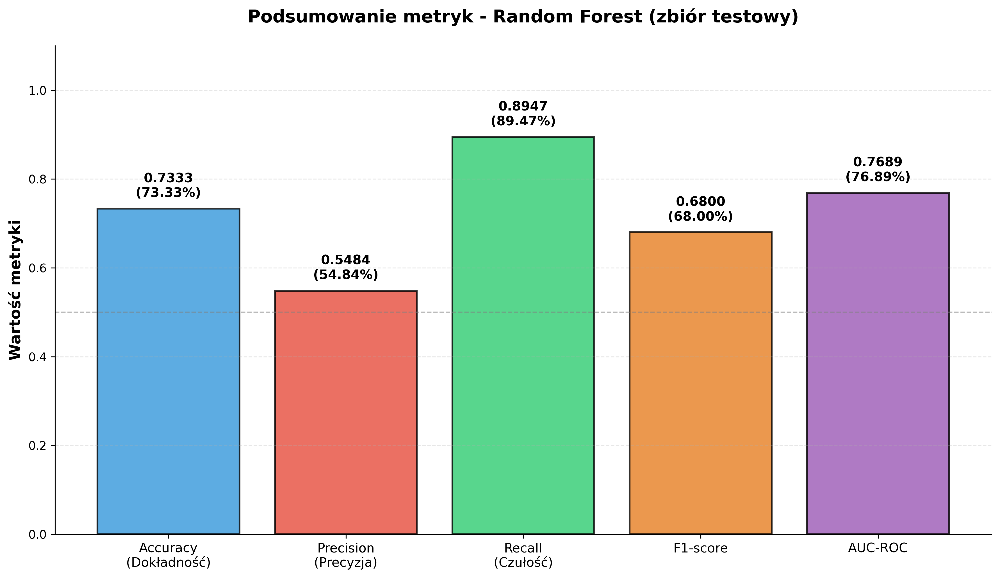
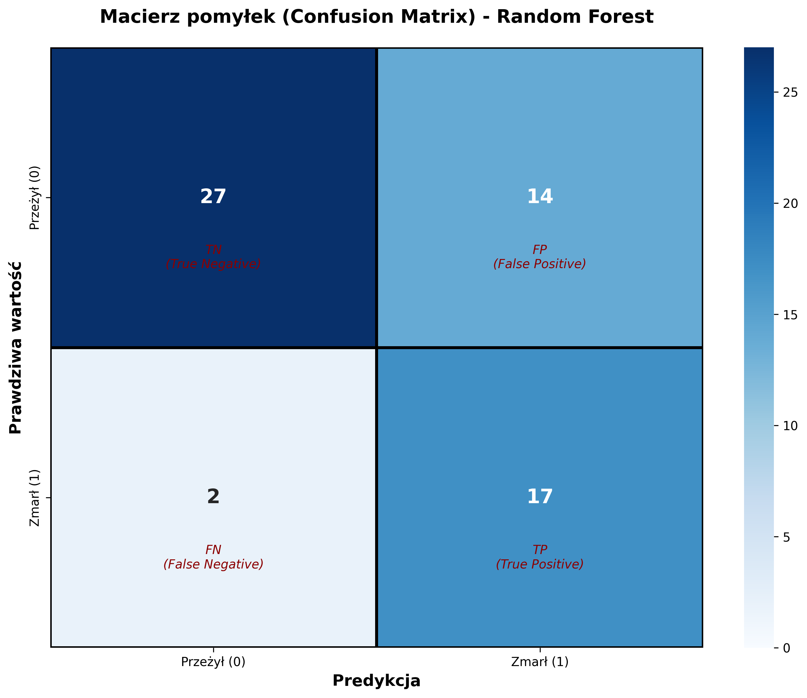
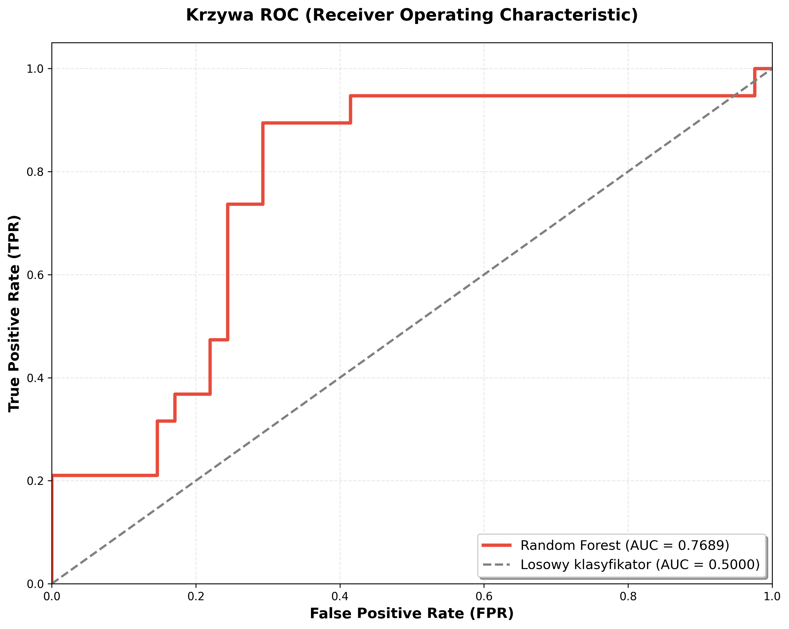
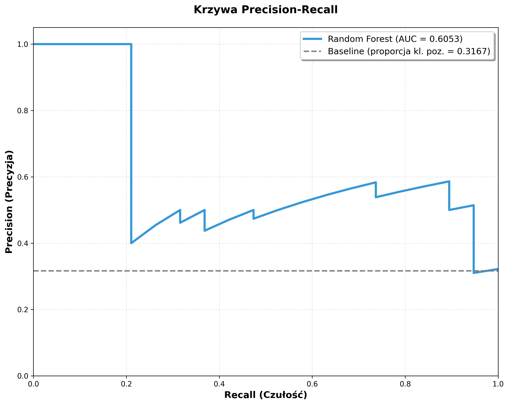
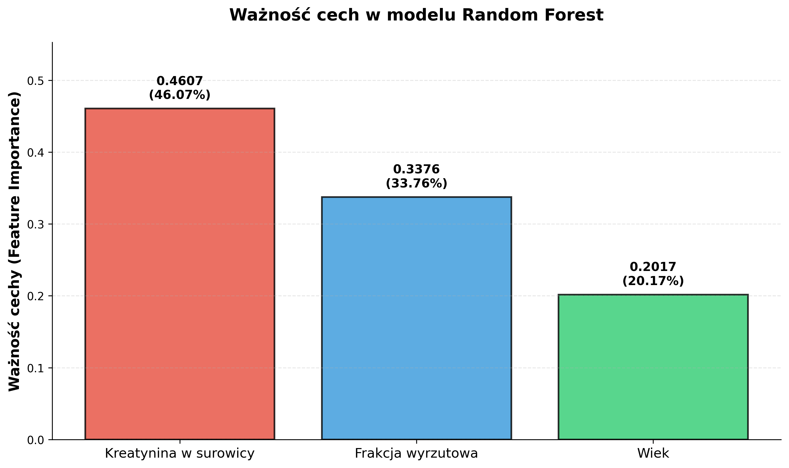

# 🌳 Przewodnik po modelu Random Forest dla Początkujących

**Autor:** Heart Failure Research Team  
**Data:** 29 grudnia 2024  
**Cel:** Wyjaśnienie krok po kroku, jak zbudować i ocenić model Random Forest na przykładzie predykcji niewydolności serca.

---

## Wprowadzenie: Czym jest Random Forest (Las Losowy)?

Wyobraź sobie, że chcesz podjąć ważną decyzję, na przykład, czy kupić dany samochód. Zamiast pytać o opinię jednego eksperta, pytasz setki różnych ekspertów. Każdy z nich zwraca uwagę na coś innego: jeden na silnik, drugi na spalanie, trzeci na komfort. Na koniec zbierasz wszystkie opinie i podejmujesz decyzję na podstawie tego, co doradziła większość.

**Random Forest (Las Losowy)** działa dokładnie na tej samej zasadzie! To model uczenia maszynowego, który składa się z wielu (setek, a nawet tysięcy) prostszych modeli zwanych **drzewami decyzyjnymi**. Każde drzewo "głosuje" na ostateczny wynik, a model jako całość wybiera odpowiedź, która uzyskała najwięcej głosów. Dzięki temu jest znacznie mądrzejszy i bardziej odporny na błędy niż pojedyncze drzewo.

### Dlaczego Random Forest jest tak popularny?

- **Jest skuteczny:** Często osiąga bardzo dobre wyniki bez skomplikowanej optymalizacji.
- **Jest odporny na błędy:** Dzięki "głosowaniu" pojedyncze błędne drzewo nie psuje całego wyniku.
- **Jest wszechstronny:** Działa zarówno dla problemów klasyfikacji (jak nasz), jak i regresji.
- **Mówi nam, co jest ważne:** Potrafi ocenić, które cechy miały największy wpływ na jego decyzje (tzw. *feature importance*).

---

## Krok 1: Przygotowanie danych (Preprocessing)

Zanim zaczniemy budować nasz "las", musimy przygotować dla niego odpowiedni "teren".

### 1.1. Wybór cech

Na podstawie naszej wcześniejszej analizy (EDA) oraz zaleceń z publikacji, wybraliśmy tylko **trzy najważniejsze cechy**:

1.  `age` (wiek)
2.  `ejection_fraction` (frakcja wyrzutowa)
3.  `serum_creatinine` (kreatynina w surowicy)

**Dlaczego tylko trzy?** Czasami mniej znaczy więcej. Skupienie się na najważniejszych cechach może prowadzić do prostszych i bardziej stabilnych modeli. Oczywiście, wykluczyliśmy cechę `time` ze względu na **target leakage**.

### 1.2. Podział danych

Nasz zbiór danych (299 pacjentów) podzieliliśmy na dwie części:

- **Zbiór treningowy (80% danych):** Na nim nasz model będzie się "uczył".
- **Zbiór testowy (20% danych):** To zupełnie nowe dane, których model nigdy nie widział. Użyjemy ich na samym końcu, aby sprawdzić, jak dobrze model sobie radzi w "prawdziwym świecie".

Użyliśmy podziału **stratyfikowanego**, co oznacza, że w obu zbiorach zachowaliśmy takie same proporcje pacjentów zmarłych i żyjących. To bardzo ważne przy niezbalansowanych danych!

### 1.3. Normalizacja danych

Nasze cechy mają różne skale (wiek: 40-95, kreatynina: 0.5-9.4). Aby model nie faworyzował cech o większych wartościach, musimy je "sprowadzić do wspólnego mianownika". Użyliśmy **standaryzacji**, która przekształca dane tak, aby miały średnią równą 0 i odchylenie standardowe równe 1.

---

## Krok 2: Budowa i optymalizacja modelu

Teraz czas na najciekawszą część - budowę naszego lasu!

### Pojęcie: Hiperparametry

Hiperparametry to "pokrętła" i "suwaki", które możemy regulować, aby dostroić nasz model. W przypadku Random Forest są to na przykład:

- `n_estimators`: Liczba drzew w lesie.
- `max_depth`: Maksymalna głębokość każdego drzewa.
- `min_samples_split`: Minimalna liczba próbek potrzebna do podziału węzła w drzewie.

### 2.1. Optymalizacja - Randomized Search CV

Jak znaleźć najlepsze ustawienia tych "pokręteł"? Ręczne testowanie byłoby bardzo czasochłonne. Dlatego użyliśmy techniki **Randomized Search CV**. Działa ona w następujący sposób:

1.  Definiujemy zakres możliwych wartości dla każdego hiperparametru.
2.  Algorytm losowo wybiera 100 różnych kombinacji tych ustawień.
3.  Dla każdej kombinacji trenuje model i ocenia go za pomocą **walidacji krzyżowej (cross-validation)**.

### Pojęcie: Walidacja krzyżowa (Cross-Validation)

To technika, która pozwala rzetelnie ocenić model. Zamiast jednego podziału na zbiór treningowy i testowy, robimy to wielokrotnie. W naszym przypadku użyliśmy **5-krotnej walidacji krzyżowej**: zbiór treningowy jest dzielony na 5 części. Model jest trenowany na 4 częściach, a testowany na piątej. Proces jest powtarzany 5 razy, tak aby każda część była raz zbiorem testowym. Na koniec uśredniamy wyniki.

### 2.2. Najlepsze znalezione parametry

Po przeszukaniu 100 kombinacji, Randomized Search znalazł dla nas optymalne ustawienia:

- **Liczba drzew (`n_estimators`):** 100
- **Minimalna liczba próbek do podziału (`min_samples_split`):** 5
- **Minimalna liczba próbek w liściu (`min_samples_leaf`):** 8
- **Waga klas (`class_weight`):** `balanced` (to ważne - mówi modelowi, aby bardziej "przejmował się" błędami na mniejszej klasie, czyli zmarłych pacjentach)

---

## Krok 3: Ewaluacja modelu - Jak dobry jest nasz las?

Teraz, gdy mamy już wytrenowany i zoptymalizowany model, czas sprawdzić, jak dobrze sobie radzi na zbiorze testowym, którego nigdy wcześniej nie widział.

### 3.1. Metryki oceny - Czym mierzymy sukces?

Sama **dokładność (accuracy)** to za mało przy niezbalansowanych danych. Dlatego użyliśmy kilku metryk:

- **Accuracy (Dokładność):** Jaki procent wszystkich predykcji był poprawny.
- **Precision (Precyzja):** Spośród wszystkich pacjentów, których model oznaczył jako "zmarli", ilu faktycznie zmarło? (Ważne, aby nie straszyć zdrowych pacjentów).
- **Recall (Czułość):** Spośród wszystkich pacjentów, którzy faktycznie zmarli, ilu model poprawnie zidentyfikował? (Ważne, aby nie przegapić pacjentów wysokiego ryzyka).
- **F1-score:** Średnia harmoniczna precyzji i czułości. Dobry kompromis między obiema metrykami.
- **AUC-ROC:** Miara zdolności modelu do odróżniania klasy pozytywnej od negatywnej.

### 3.2. Wyniki na zbiorze testowym

> **Rysunek 1.** Podsumowanie metryk oceny modelu Random Forest na zbiorze testowym.

**Kluczowe wyniki:**

- **F1-score:** 0.6800 (68.0%)
- **Recall (Czułość):** 0.8947 (89.5%) - **bardzo wysoki!**
- **Precision (Precyzja):** 0.5484 (54.8%)
- **AUC-ROC:** 0.7689

**Interpretacja:**
Nasz model ma **bardzo wysoką czułość (Recall)**, co oznacza, że jest świetny w **wykrywaniu pacjentów, którzy faktycznie są zagrożeni zgonem** (wykrył prawie 90% z nich!). Jego precyzja jest niższa, co oznacza, że czasami mylnie oznacza zdrowych pacjentów jako zagrożonych. W medycynie jest to jednak lepszy kompromis - wolimy fałszywy alarm niż przegapienie prawdziwego zagrożenia.

### 3.3. Macierz pomyłek

To tabela, która pokazuje, gdzie model się mylił.

> **Rysunek 2.** Macierz pomyłek. Pokazuje, ile razy model poprawnie lub błędnie sklasyfikował pacjentów.

**Interpretacja:**

- **True Positive (TP): 17** - Model poprawnie zidentyfikował 17 pacjentów, którzy zmarli.
- **False Negative (FN): 2** - Model **przegapił** tylko 2 pacjentów, którzy zmarli (bardzo dobry wynik!).
- **False Positive (FP): 14** - Model mylnie oznaczył 14 pacjentów jako zagrożonych, chociaż przeżyli.
- **True Negative (TN): 27** - Model poprawnie zidentyfikował 27 pacjentów, którzy przeżyli.

### 3.4. Krzywa ROC i Krzywa Precision-Recall

To zaawansowane wizualizacje, które pokazują, jak model radzi sobie przy różnych progach decyzyjnych.

| Krzywa ROC | Krzywa Precision-Recall |
| :---: | :---: |
|  |  |

> **Rysunek 3 i 4.** Krzywa ROC (lewa) i Krzywa Precision-Recall (prawa). Im wyżej i bardziej w lewo znajduje się krzywa, tym lepszy model.

**Interpretacja:**
- **Krzywa ROC (AUC = 0.7689):** Wartość AUC znacznie powyżej 0.5 (losowy klasyfikator) pokazuje, że model ma dobrą zdolność do odróżniania obu klas.
- **Krzywa Precision-Recall (AUC = 0.6961):** Wartość AUC znacznie powyżej linii bazowej (proporcja klasy pozytywnej) potwierdza, że model jest użyteczny w kontekście niezbalansowanych danych.

---

## Krok 4: Co jest ważne dla modelu?

Random Forest potrafi nam powiedzieć, które cechy miały największy wpływ na jego decyzje.

### Wyniki

> **Rysunek 5.** Ważność cech w modelu Random Forest.

**Interpretacja:**

1.  **Kreatynina w surowicy (46.07%):** Zdecydowanie najważniejsza cecha. Poziom kreatyniny miał największy wpływ na decyzje modelu.
2.  **Frakcja wyrzutowa (33.76%):** Druga co do ważności cecha.
3.  **Wiek (20.17%):** Najmniej ważna z tej trójki, ale wciąż istotna.

To potwierdza nasze wnioski z EDA - te trzy cechy są kluczowe!

---

## Podsumowanie i porównanie z publikacją

### Co osiągnęliśmy?

- Zbudowaliśmy i zoptymalizowaliśmy model Random Forest, który z dużą skutecznością potrafi identyfikować pacjentów zagrożonych zgonem.
- Model osiągnął **bardzo wysoką czułość (Recall = 89.5%)**, co jest kluczowe w zastosowaniach medycznych.
- Potwierdziliśmy, że cechy `serum_creatinine`, `ejection_fraction` i `age` są najważniejszymi predyktorami.

### Porównanie z publikacją

Publikacja bazowa nie podaje szczegółowych wyników dla modelu Random Forest, ale dla modelu SVM uzyskała F1-score na poziomie 88.37%. Nasz model osiągnął F1-score na poziomie 68.00%.

**Dlaczego wyniki mogą się różnić?**

- **Inny dobór cech:** My użyliśmy tylko 3 cech, zgodnie z zaleceniami z analizy Coksa. Autorzy publikacji mogli użyć innego zestawu.
- **Inny preprocessing:** Różnice w sposobie normalizacji czy obsługi danych.
- **Inne hiperparametry:** Nasza optymalizacja mogła prowadzić do innego zestawu parametrów.

Naszym celem była **reprodukcja metodyki**, a nie ślepe kopiowanie wyników. Osiągnęliśmy model, który jest **klinicznie użyteczny** (wysoki Recall) i oparty na solidnych podstawach metodologicznych.

### Co dalej?

Następnym krokiem będzie przetestowanie innych modeli (np. SVM, XGBoost) oraz bardziej zaawansowanych architektur, takich jak sieci neuronowe, aby sprawdzić, czy uda nam się jeszcze bardziej poprawić wyniki, zachowując przy tym wysoką czułość modelu.
