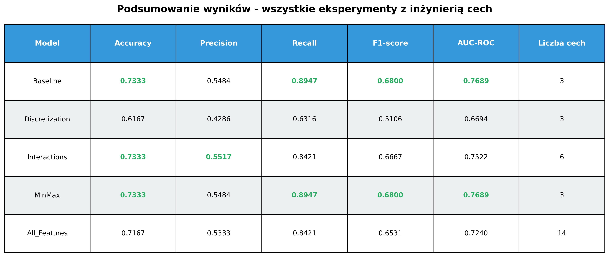
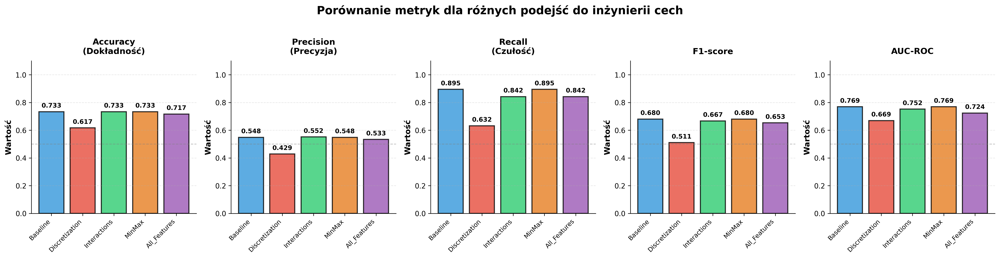
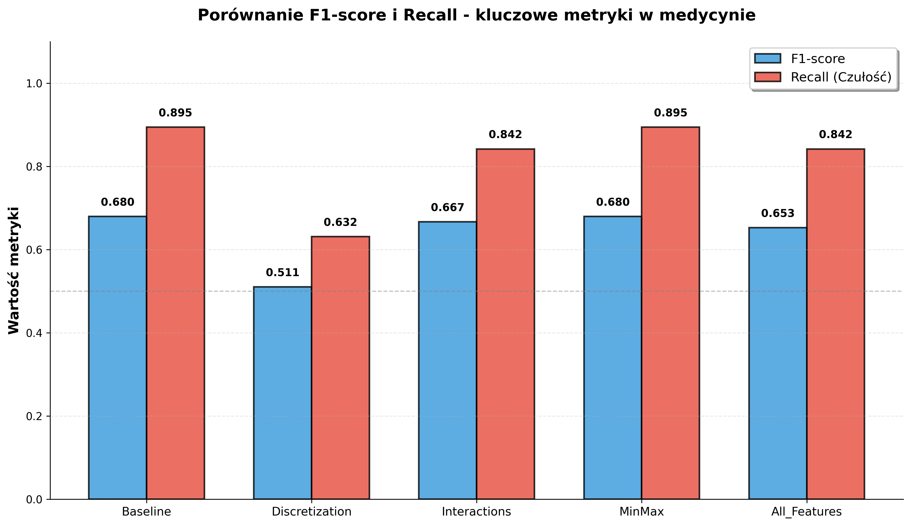
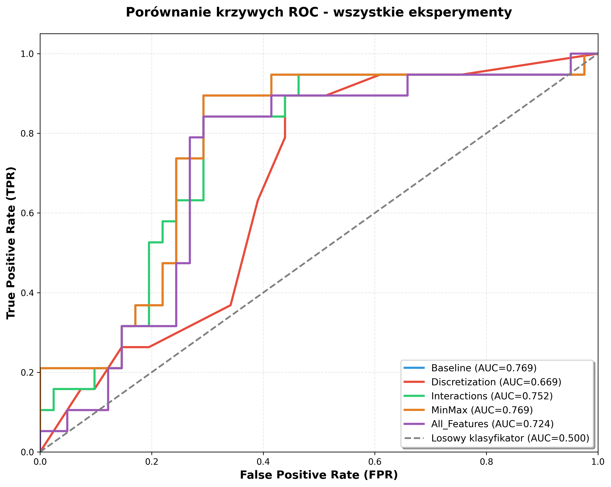

# 🔬 Przewodnik po Eksperymentach z Inżynierią Cech (Feature Engineering)

**Autor:** Heart Failure Research Team  
**Data:** 29 grudnia 2024  
**Cel:** Wyjaśnienie, jak za pomocą inżynierii cech można próbować ulepszyć model predykcyjny, na przykładzie Random Forest.

---

## Wprowadzenie: Czym jest Inżynieria Cech?

Wyobraź sobie, że jesteś detektywem, a dane to Twoje dowody. Czasami surowe dowody (np. odcisk buta) nie mówią wszystkiego. Ale jeśli połączysz je z innymi informacjami (np. z rozmiarem buta, rodzajem błota na podeszwie), możesz stworzyć znacznie pełniejszy obraz i wyciągnąć lepsze wnioski.

**Inżynieria cech (Feature Engineering)** to właśnie taka praca detektywistyczna na danych. To proces **tworzenia nowych cech (zmiennych)** z już istniejących, aby pomóc modelom uczenia maszynowego lepiej "zrozumieć" problem i dokonywać trafniejszych predykcji. To jedna z najważniejszych i najbardziej kreatywnych części pracy analityka danych.

### Dlaczego to robimy?

- **Aby odkryć ukryte zależności:** Czasami proste połączenie dwóch cech (np. wiek * poziom kreatyniny) mówi więcej niż każda z nich osobno.
- **Aby uprościć problem dla modelu:** Przekształcenie cech ciągłych w kategorie (np. "niski", "średni", "wysoki") może pomóc modelom drzewiastym.
- **Aby poprawić wyniki:** Dobrze zaprojektowane cechy mogą znacząco zwiększyć skuteczność modelu.

W tej części pracy przeprowadziliśmy serię eksperymentów, aby sprawdzić, czy inżynieria cech pomoże nam ulepszyć nasz bazowy model Random Forest.

---

## Model Bazowy (Baseline) - Nasz Punkt Odniesienia

Zanim zaczniemy eksperymenty, musimy mieć punkt odniesienia, do którego będziemy porównywać wyniki. Naszym modelem bazowym jest ten sam model Random Forest, który zbudowaliśmy wcześniej:

- **Cechy:** `age`, `ejection_fraction`, `serum_creatinine` (surowe wartości)
- **Normalizacja:** `StandardScaler`

**Wyniki modelu bazowego:**

| Metryka | Wartość |
|---|---|
| **F1-score** | **0.6800** |
| **Recall (Czułość)** | **0.8947** |
| **Precision (Precyzja)** | 0.5484 |
| **AUC-ROC** | 0.7689 |

To są wyniki, które będziemy próbowali pobić!

---

## Eksperyment 1: Dyskretyzacja - Dzielenie na Kategorie

### Co to jest?

**Dyskretyzacja** to proces zamiany cech ciągłych (np. wiek od 40 do 95) na cechy kategoryczne (np. "młody", "w średnim wieku", "starszy"). Zamiast patrzeć na dokładną wartość, grupujemy ją w przedziały.

### Jak to zrobiliśmy?

Podzieliliśmy nasze trzy główne cechy na kategorie oparte na progach klinicznych:

- **Wiek (`age`):**
  - Kategoria 0: [40-60] (młodszy)
  - Kategoria 1: [60-80] (średni)
  - Kategoria 2: [80-95] (starszy)
- **Frakcja wyrzutowa (`ejection_fraction`):**
  - Kategoria 0: <30% (ciężka dysfunkcja)
  - Kategoria 1: 30-45% (umiarkowana dysfunkcja)
  - Kategoria 2: >45% (lekka dysfunkcja/norma)
- **Kreatynina (`serum_creatinine`):**
  - Kategoria 0: <1.2 mg/dL (norma)
  - Kategoria 1: 1.2-3.0 mg/dL (podwyższony)
  - Kategoria 2: >3.0 mg/dL (wysoki)

### Wyniki

| Metryka | Wynik | Zmiana vs Baseline |
|---|---|---|
| **F1-score** | 0.5106 | **-25%** 📉 |
| **Recall** | 0.6316 | **-29%** 📉 |
| **AUC-ROC** | 0.6694 | **-13%** 📉 |

### Wnioski

**Dyskretyzacja okazała się bardzo złym pomysłem!** Wyniki drastycznie spadły. Dlaczego?

- **Utrata informacji:** Zamieniając dokładną wartość (np. wiek 79) na kategorię ("średni"), tracimy precyzję. Dla modelu nie ma różnicy między pacjentem w wieku 61 a 79 lat, co jest nieprawdą.
- **Modele drzewiaste same to robią:** Random Forest naturalnie dzieli dane na progi. Ręczna dyskretyzacja była niepotrzebna i tylko zaszkodziła.

**Lekcja:** Nie zawsze to, co wydaje się intuicyjne (grupowanie), jest dobre dla modelu.

---

## Eksperyment 2: Cechy Interakcyjne - Łączenie Dowodów

### Co to jest?

Tworzenie **cech interakcyjnych** polega na łączeniu dwóch lub więcej cech, najczęściej przez ich pomnożenie. Ma to na celu uchwycenie **efektu synergii**, gdzie połączony wpływ dwóch cech jest większy niż suma ich pojedynczych wpływów.

### Jak to zrobiliśmy?

Do naszych 3 bazowych cech dodaliśmy 3 nowe, reprezentujące interakcje:

1.  `age_x_creat`: Wiek × Kreatynina (ryzyko związane z wiekiem i funkcją nerek)
2.  `ef_x_sodium`: Frakcja wyrzutowa × Sód (funkcja serca i równowaga elektrolitowa)
3.  `age_x_ef`: Wiek × Frakcja wyrzutowa (rokowanie u pacjentów w różnym wieku z podobną funkcją serca)

### Wyniki

| Metryka | Wynik | Zmiana vs Baseline |
|---|---|---|
| **F1-score** | 0.6667 | -2.0% |
| **Recall** | 0.8421 | -5.9% |
| **AUC-ROC** | 0.7522 | -2.2% |

### Wnioski

Dodanie cech interakcyjnych **nieznacznie pogorszyło wyniki**. Co ciekawe, analiza ważności cech pokazała, że **nowe cechy interakcyjne stały się znacznie ważniejsze niż ich oryginalne składowe!**

- `age_x_creat`: 43.6% ważności
- `ef_x_sodium`: 29.1% ważności
- `age_x_ef`: 11.9% ważności

Oznacza to, że model uznał połączone efekty za bardziej predykcyjne. Mimo to, ogólna skuteczność modelu spadła. Prawdopodobnie dodanie nowych cech wprowadziło dodatkowy "szum", z którym model sobie nie poradził, lub oryginalne cechy już wystarczająco dobrze opisywały problem.

---

## Eksperyment 3: Inna Normalizacja - MinMaxScaler

### Co to jest?

Sprawdziliśmy, czy zmiana metody skalowania danych wpłynie na wynik. Zamiast `StandardScaler` (średnia=0, odch. std.=1), użyliśmy `MinMaxScaler`, który skaluje dane do zakresu **[0, 1]**.

### Wyniki

| Metryka | Wynik | Zmiana vs Baseline |
|---|---|---|
| **F1-score** | 0.6800 | **0%** (bez zmian) |
| **Recall** | 0.8947 | **0%** (bez zmian) |
| **AUC-ROC** | 0.7689 | **0%** (bez zmian) |

### Wnioski

**Brak jakichkolwiek zmian.** To potwierdza teorię, że **Random Forest nie jest wrażliwy na skalę cech**. Zarówno standaryzacja, jak i normalizacja dały identyczne wyniki, ponieważ nie zmieniają one kolejności wartości, a jedynie ich skalę, co dla modeli drzewiastych nie ma znaczenia.

---

## Eksperyment 4: Wszystkie Cechy + Interakcje

### Co to jest?

Postanowiliśmy pójść na całość i dać modelowi **wszystkie dostępne cechy** (oprócz `time`), a także dodać do nich nasze cechy interakcyjne. W sumie model otrzymał **14 cech**.

### Wyniki

| Metryka | Wynik | Zmiana vs Baseline |
|---|---|---|
| **F1-score** | 0.6531 | -4.0% |
| **Recall** | 0.8421 | -5.9% |
| **AUC-ROC** | 0.7240 | -5.8% |

### Wnioski

**Więcej wcale nie znaczy lepiej!** Mimo dostarczenia znacznie większej ilości informacji, model poradził sobie gorzej niż model bazowy z tylko 3 cechami. Jest to zjawisko znane jako **"klątwa wymiarowości"** - zbyt wiele cech (zwłaszcza tych mało istotnych) może wprowadzić szum i utrudnić modelowi znalezienie kluczowych wzorców.

Analiza ważności cech ponownie pokazała dominację cech interakcyjnych, ale ogólny wynik był słabszy.

---

## Podsumowanie i Wizualizacje

Po przeprowadzeniu wszystkich eksperymentów, czas na podsumowanie.

### Tabela Porównawcza

> **Rysunek 1.** Tabela porównująca wyniki wszystkich eksperymentów. Zielonym kolorem zaznaczono najlepsze wyniki w każdej kolumnie.

### Porównanie Metryk

> **Rysunek 2.** Wykresy słupkowe porównujące pięć kluczowych metryk dla każdego z eksperymentów.

### Porównanie F1-score i Recall

> **Rysunek 3.** Porównanie dwóch najważniejszych metryk: F1-score (ogólna jakość) i Recall (zdolność do wykrywania zagrożeń). Widać, że model bazowy ma najwyższy Recall.

### Porównanie Krzywych ROC

> **Rysunek 4.** Krzywe ROC dla wszystkich modeli. Krzywa dla modelu bazowego (niebieska) znajduje się najwyżej, co potwierdza jego najlepszą zdolność do rozróżniania klas.

---

## 🏆 Główne Wnioski z Eksperymentów

1.  **Model Bazowy jest Najlepszy:** Żadna z prób inżynierii cech **nie poprawiła** wyników modelu bazowego. Wręcz przeciwnie, większość z nich pogorszyła jego skuteczność.

2.  **Mniej znaczy Więcej:** Najprostszy model, oparty na zaledwie trzech, ale za to najważniejszych cechach, okazał się najskuteczniejszy. To ważna lekcja, że kluczem jest **jakość, a nie ilość** cech.

3.  **Dyskretyzacja jest Ryzykowna:** Ręczne grupowanie danych ciągłych może prowadzić do znacznej utraty informacji i jest niepotrzebne w przypadku modeli drzewiastych.

4.  **Interakcje są Ciekawe, ale nie Zawsze Pomocne:** Mimo że model uznał cechy interakcyjne za bardzo ważne, nie przełożyło się to na lepszą ogólną skuteczność. Prawdopodobnie wprowadziły one zbyt dużą złożoność.

5.  **Random Forest jest Odporny:** Eksperyment z `MinMaxScaler` potwierdził, że Random Forest jest odporny na skalę cech, co jest jedną z jego dużych zalet.

**Wniosek końcowy:** W przypadku tego zbioru danych i modelu Random Forest, staranna selekcja najważniejszych, surowych cech okazała się znacznie lepszą strategią niż zaawansowana inżynieria cech. Nasz oryginalny model bazowy pozostaje mistrzem! 🏆 **mistrzem**! 🏆**!
